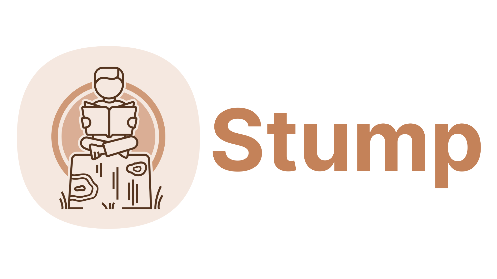

<p align="center">
  
  <br />
  <a href="https://github.com/awesome-selfhosted/awesome-selfhosted#document-management---e-books">
    
  </a>
  <a href="https://discord.gg/63Ybb7J3as">
    
  </a>
  <a href="https://github.com/aaronleopold/stump/blob/main/LICENSE">
    
  </a>
  <!-- <a href="https://app.getpostman.com/run-collection/6434946-9cf51d71-d680-46f5-89da-7b6cf7213a20?action=collection%2Ffork&collection-url=entityId%3D6434946-9cf51d71-d680-46f5-89da-7b6cf7213a20%26entityType%3Dcollection%26workspaceId%3D722014ea-55eb-4a49-b29d-814300c1016d">
    
  </a> -->
  <!-- <a href="./.github/CHANGELOG.md">
    
  </a> -->
  <a href="https://hub.docker.com/r/aaronleopold/stump">
    
  </a>
</p>

<p align='center'>
Stump is a free and open source comics, manga and digital book server with OPDS support, created with <a href="https://www.rust-lang.org/">Rust</a>, <a href='https://github.com/tokio-rs/axum'>Axum</a>, <a href='https://github.com/Brendonovich/prisma-client-rust'>Prisma</a> and <a href='https://reactjs.org/'>React</a>.
</p>

<p align='center'>

</p>

<!-- prettier-ignore: I hate you sometimes prettier -->
<details>
  <summary><b>Table of Contents</b></summary>
  <p>

- [Roadmap 🗺](#roadmap-)
- [Getting Started 🚀](#getting-started-)
- [Developer Guide 💻](#developer-guide-)
  - [Where to start?](#where-to-start)
- [Project Structure 📦](#project-structure-)
  - [/apps](#apps)
  - [/packages](#packages)
  - [/core](#core)
- [Similar Projects 👯](#similar-projects-)
- [Acknowledgements 🙏](#acknowledgements-)
</details>

> **🚧 Disclaimer 🚧**: Stump is _very much_ an ongoing **WIP**, under active development. Anyone is welcome to try it out, but please keep in mind that installation and general usage at this point should be for **testing purposes only**. Do **not** expect a fully featured, bug-free experience if you spin up a development environment or use a testing Docker image. Before the first release, I will likely flatten the migrations anyways, which would break anyone's Stump installations. If you'd like to contribute and help expedite Stump's first release, please review the [developer guide](#developing-). Otherwise, stay tuned for the first release!

## Roadmap 🗺

The following items are the major targets for Stump's first release:

- 📃 Full OPDS + OPDS Page Streaming support
- 📕 EPUB, PDF, and CBZ/CBR support
- 📚 Organize libraries with collections and reading lists
- 🔎 Versitile full-text search
- 🔐 Role-based access-control with managed user accounts and configurable privileges
- 🚀 Easy setup and deployment using Docker or bare metal
- 👀 Fully responsive, built-in UI with a dark mode
- 🏃 Low resource utilization with excellent performance
- 🧰 Easily consumable and self-documented REST API, so community tools and scripts can interact with Stump
- 🌈 And more!

Things you can expect to see after the first release:

- 🖥️ Desktop app ([Tauri](https://github.com/aaronleopold/stump/tree/main/apps/desktop))
- 📱 Mobile app ([Tachiyomi](https://github.com/aaronleopold/tachiyomi-extensions) and/or [custom application](https://github.com/aaronleopold/stump/tree/main/apps/mobile))

Things you might see in the future:

- 📺 A utility [TUI](https://github.com/aaronleopold/stump/tree/main/apps/tui) for managing a Stump instance(s) from the command line

I am very open to suggestions and ideas, so feel free to reach out if you have anything you'd like to see!

> For more, feel free to view the [FAQ](https://stumpapp.dev/faq) page. If you're interested in tracking the development of specific features, you can take a look at my personal [task board](https://github.com/users/aaronleopold/projects/2).

## Getting Started 🚀

Stump isn't ready for normal, non-development usage yet. Once a release has been made, this will be updated. For now, follow the [Developing](#developing-) section to build from source and run locally.

There is a [docker image](https://hub.docker.com/repository/docker/aaronleopold/stump) available for those interested. However, **this is only meant for testing purposes and will not be updated frequently**, so do not expect a fully featured, bug-free experience if you spin up a container. Also keep in mind migrations won't be stacked until a release, so each update until then might require a wipe of the database file.

For more information about getting started, how Stump works and how it manages your library, and much more, please visit [stumpapp.dev](https://stumpapp.dev/guides).

## Developer Guide 💻

Contributions are very **encouraged** and **welcome**! Please review the [CONTRIBUTING.md](https://github.com/aaronleopold/stump/tree/develop/.github/CONTRIBUTING.md) before getting started.

A quick summary of the steps required to get going:

1. Install [pnpm](https://pnpm.io/installation), [rust](https://www.rust-lang.org/tools/install) and [node](https://nodejs.org/en/download/)
   - If you're running Windows, you will need [Visual C++](https://docs.microsoft.com/en-us/cpp/windows/latest-supported-vc-redist?view=msvc-170)
   - If you're running macOS on Apple Silicon, you'll need to install [Rosetta](https://support.apple.com/en-us/HT211861)
2. Install [cargo-watch](https://crates.io/crates/cargo-watch)
3. Run the setup:

```bash
pnpm run setup
```

4. Start one of the apps:

I use [moonrepo](https://moonrepo.dev/) for Stump's repository management

```bash
# webapp + server
moon run :dev
# desktop app + server
moon run server:start desktop:desktop-dev
```

And that's it!

#### Where to start?

If you aren't sure where to start, I recommend taking a look at the [task board](https://github.com/users/aaronleopold/projects/2). This is where I track the broader development items for Stump. It is mostly for my own personal organization, but should still hopefully give you an idea of what needs work.

You can also check out the [v0.1.0 milestone](https://github.com/aaronleopold/stump/milestone/1) for a more filtered list of major features planned for that 0.1.0 release.

Some other good places to start:

- Translation, so Stump is accessible to non-English speakers.
  - An automated translation system would be immensely helpful! If you're knowledgeable in this area, please reach out!
- Writing comprehensive [integration tests](https://github.com/aaronleopold/stump/tree/develop/core/integration-tests).
- Designing and/or implementing UI elements.
- Docker build optimizations (it is currently _horrendously_ slow).
- CI pipelines / workflows.
- And lots more!

[](https://app.getpostman.com/run-collection/6434946-9cf51d71-d680-46f5-89da-7b6cf7213a20?action=collection%2Ffork&collection-url=entityId%3D6434946-9cf51d71-d680-46f5-89da-7b6cf7213a20%26entityType%3Dcollection%26workspaceId%3D722014ea-55eb-4a49-b29d-814300c1016d)

## Project Structure 📦

Stump has a monorepo structure that follows a similar pattern to that of [Spacedrive](https://www.spacedrive.com/).

### /apps

- `desktop`: A Tauri application.
- `server`: An [Axum](https://github.com/tokio-rs/axum) server.
- `web`: The React application that is served by the Axum server.

### /packages

- `client`: Everything needed to create a react-based client for Stump. Contains Zustand and React Query configuration, used by the `interface` package, as well as the generated TypeScript types.
- `config`: Configuration files for the project, e.g. `tsconfig.json`, etc.
- `interface`: Stump's main React-based interface, shared between the web and desktop applications.
- `prisma-cli`: A small rust app to run the prisma cli (generating the prisma client)

### /core

- `core`: Stump's 'core' functionality is located here, written in Rust. The `server` was previously part of the core, but was extracted for better isolation.

## Similar Projects 👯

There are a number of other projects that are similar to Stump, it certainly isn't the first or only digital book media server out there. If Stump isn't for you, or you want to check out similar projects in the rust and/or self hosting spaces, consider checking out these other open source projects:

- [Komga](https://github.com/gotson/komga)
- [Kavita](https://github.com/Kareadita/Kavita)
- [audiobookshelf](https://github.com/advplyr/audiobookshelf) (_Audio books, Podcasts_)
- [Dim](https://github.com/Dusk-Labs/dim) (_Video, Audio_) (✨*Rust*✨)
- [tonbun](https://github.com/KPidS/tonbun) (_Reading and downloading manga_) (✨*Rust*✨)

## Acknowledgements 🙏

- [Komga](https://github.com/gotson/komga) is a huge inspiration for Stump, an amazing comics/manga media server written in Kotlin.
- [Brendonovich](https://github.com/Brendonovich) for building [prisma client rust](https://github.com/Brendonovich/prisma-client-rust), which allows me to use Prisma with Rust. Stump previously used SeaORM, but the DX simply can't compare to Prisma.
